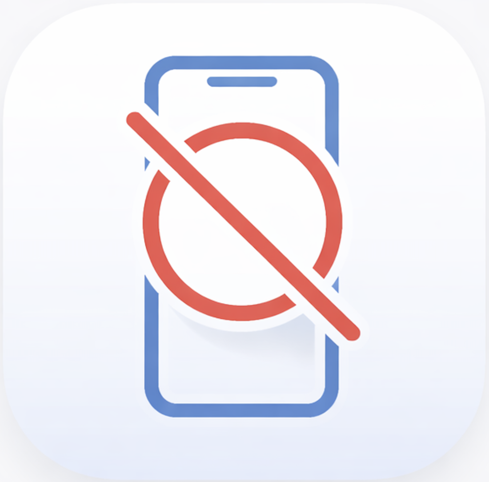

# DistrACT

> Struggling with your studies? Don't get distr**ACT**ed, **ACT** now!

<p align="center">
  
</p>

DistrACT is a real-time phone detection tool that catches you when you reach for your phone during study sessions. It uses computer vision to detect your phone through your webcam and alerts you to get back to work.

## How It Works

1. **Detection** - Faster R-CNN (MobileNetV3 backbone) pre-trained on COCO detects phones in your webcam feed
2. **Tracking** - A timer starts when a phone is detected; if held for a configurable number of seconds, you're flagged as distracted
3. **Alert** - A sound plays and a visual alert pops up telling you to put your phone down

The detection runs in a **separate thread**, keeping the webcam feed smooth while the model processes frames in the background.

## Two Modes

| Mode         | Command          | Description                                                   |
| ------------ | ---------------- | ------------------------------------------------------------- |
| **Webcam**   | `python main.py` | Live video feed with bounding boxes and OpenCV alerts         |
| **Menu Bar** | `python app.py`  | Runs silently in the macOS menu bar with native notifications |

## Setup

```bash
# Clone the repo
git clone https://github.com/notstrada10/DistrACT.git
cd DistrACT

# Create and activate virtual environment
python -m venv venv
source venv/bin/activate

# Install dependencies
pip install -r requirements.txt

# Run it
python main.py      # webcam mode
python app.py       # menu bar mode (macOS only)
```

## Configuration

All settings are in `config.yaml`:

```yaml
detection:
    confidence_threshold: 0.6 # how sure the model must be (0.0 - 1.0)

tracker:
    threshold_seconds: 3 # seconds before triggering alert

alert:
    cooldown_seconds: 5 # minimum time between alerts
    image_path: "img/putdown.jpg"
    sound_path: "/System/Library/Sounds/Sosumi.aiff"
```

## Project Structure

```
DistrACT/
├── main.py          # Webcam mode entry point
├── app.py           # macOS menu bar app
├── detector.py      # Faster R-CNN phone detection (threaded)
├── tracker.py       # Distraction state tracking
├── alert.py         # Alert system (sound + image)
├── config.yaml      # User-configurable settings
├── img/             # Alert images and logo
└── requirements.txt
```

## Tech Stack

- **PyTorch + torchvision** - Faster R-CNN with MobileNetV3 backbone
- **OpenCV** - Webcam capture and display
- **rumps** - macOS menu bar integration
- **COCO dataset** - Pre-trained weights (no custom training needed)

## Requirements

- Python 3.10+
- macOS (for menu bar mode and `afplay` sound alerts)
- Webcam
